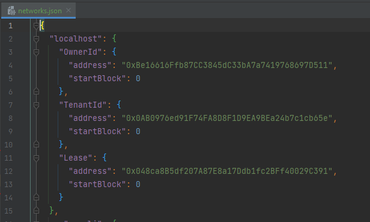
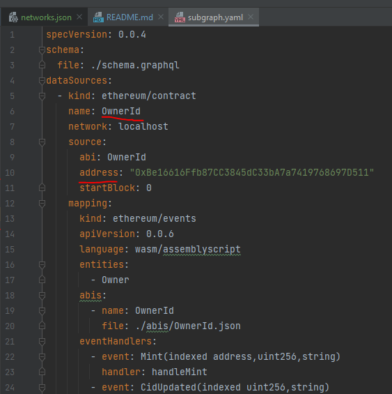

## Problem

---

## Solution

# Trust protocol Dapp

## Introduction

Trust protocol uses smart contracts hosted on the Ethereum blockchain to provide a decentralized, trustless, and transparent way to record rent payments between 2 parties.

---

## Technologies used

Our smart contracts are hosted on the ethereum blockchain - Using Meganode (NodeReal) as our node provider.

We use WalletConnect to allow users to connect their Ethereum wallet to our Dapp using the WalletConnect of their choice, including Ledger which can be connected through LedgerLive to sign transactions, create user and owner accounts, and transfer tokens for rent payment.

Trust protocol allows owners to ask for rent payments in any ERC20 token with a price indexed on Fiat currency; To offer a live exchange rate, our Dapp uses Iexec Oracles, generated through the Iexec Oracle Factory.
The protocol allows the addition of any number or oracle for conversion rates, and intends to offer more and more payment choices to users.

Our Smart contract addresses:

_Goerli:_

IexecRateOracle 0x243C3FEF3271F72884BF93eFf9af5b8D8A739815

ownerIdContract 0x01dbf024D566a5006a6eAFFaF7b286AF73dC6409

tenantIdContract 0xE18a3Ed893361cAA3a207306197Ceebd47C6BcA5

croesusToken 0x2E2CfeA8A06c29a25B502F8D69498FbfbDE94F6c

leaseContract 0xE7304dF39c9f861D0fe210f441Ded3f8Dd057440

Addresses on Goerli Scan:

https://goerli.etherscan.io/address/0x243C3FEF3271F72884BF93eFf9af5b8D8A739815
https://goerli.etherscan.io/address/0x01dbf024D566a5006a6eAFFaF7b286AF73dC6409
https://goerli.etherscan.io/address/0xE18a3Ed893361cAA3a207306197Ceebd47C6BcA5#readContract
https://goerli.etherscan.io/address/0xE7304dF39c9f861D0fe210f441Ded3f8Dd057440
https://goerli.etherscan.io/address/0x2E2CfeA8A06c29a25B502F8D69498FbfbDE94F6c#readContract

_What was your biggest technical challenge and how does your solution solve it?_
![Problem slide]https://github.com/maofalt/starton_readme_test/blob/main/%5B0%5DOutsider%20Lab%20-%20Solution%20-2.jpg.jpg?raw=true)

---

## Facility

_Explain, step-by-step, how someone can install your project and use it. The jury will mainly use MacOS, Ubuntu, Android, and iOS. Setting up a docker/docker-compose is a good idea to allow someone to test the project easily._

## How to set up a local environment / install

=======

_What was your biggest technical challenge and how does your solution solve it?_
![Problem slide]https://github.com/maofalt/starton_readme_test/blob/main/%5B0%5DOutsider%20Lab%20-%20Solution%20-2.jpg.jpg?raw=true)

---

## Facility

_Explain, step-by-step, how someone can install your project and use it. The jury will mainly use MacOS, Ubuntu, Android, and iOS. Setting up a docker/docker-compose is a good idea to allow someone to test the project easily._

## How to set up a local environment / install

### Requirement

> NodeJS 18+ LTS

### General Settings

---

### Smart Contracts Settings

#### Open a terminal in the "/_contract URI folder_"

Execute the following commands:

> cd ./contracts
>
> npm ci
>
> npm run start
>
> Keep this terminal open and open a new one in the root folder of the project in the same directory
> and execute the following command:

> npm run deploy:localhost

The logs will print contract addresses as such:

Keep these at hand as you will need them in the next step.

---

### Sub-Graph Settings

Copy / Paste each contract address from the previous section to the following files at the root of the sub-graph directory:

- networks.json: Replace the corresponding addresses in the "localhost" section:

- subgraph.yaml: Replace the corresponding addresses in the "address" section:

- Same goes for the frontend folder (/frontend/src/config/trust.config_localhost.json)

#### Open a Docker container (Docker Desktop or terminal) and execute the following commands in the "/_sub-graph URI folder_":

> cd ./sub-graph
>
> npm ci
>
> docker compose up (or sh run-graph-node.sh for unix users)

Keep this terminal open and open a new one in the same directory
and execute the following command:

> npm run start

/!\ **Make sure to keep the "node" & "Docker" terminals open at all time during your use of the Dapp** /!\

## _You are now all set for runnintg the dapp :)_

---

### Frontend

To serve the website locally, execute the following commands

> cd ./frontend
>
> npm ci
>
> npm run build && npm run preview

## Team and comments

---

## Team and comments

_Specify the name of your team (the same as on the discord/gather), and tell us what you learned during this hackathon!_

